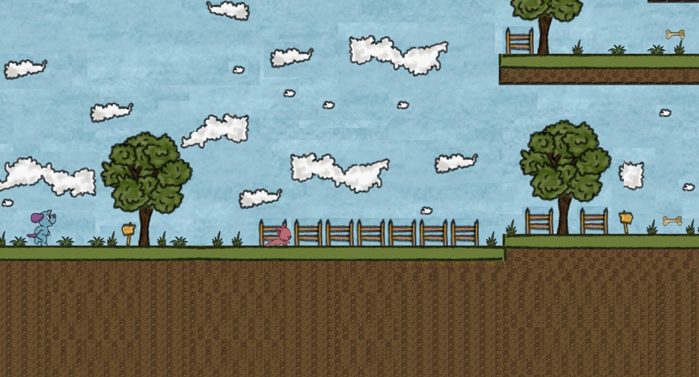
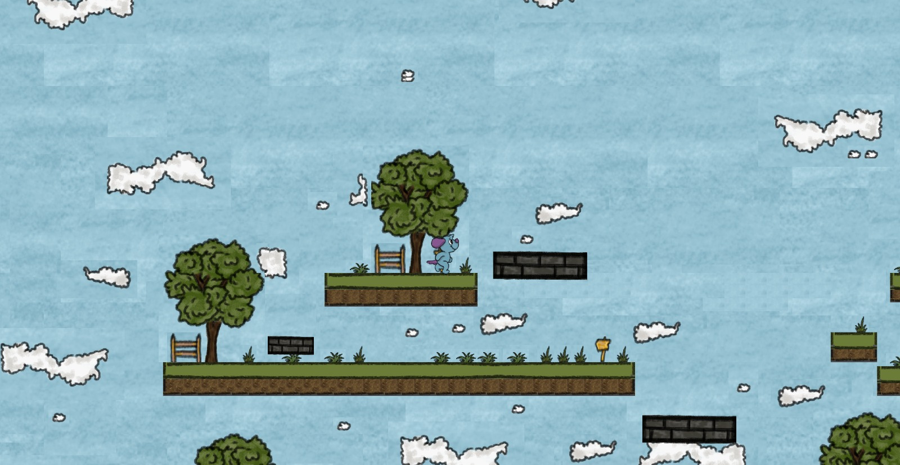

# Godot 2D Platformer

A 2D platformer game developed in Godot Engine.

All characters, environment assets, collectibles, and visual elements were designed and created by me.

## Features

- Character movement and jumping
- Enemy AI
- Collectible bones
- Score system
- Sound effects
- Background music
- Game Over and restart system

## Level Design

## Asset Design

## Gameplay

